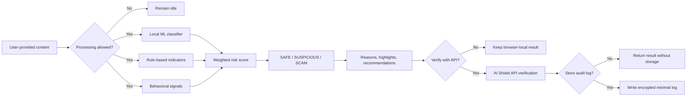
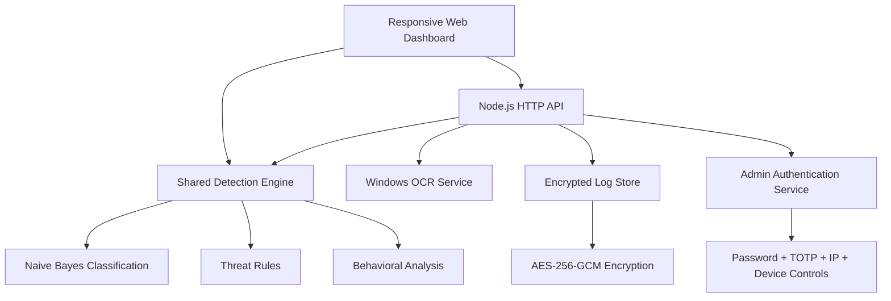

# AI Shield

<div align="center">

### Detect scams before they cost you.

Privacy-first scam and phishing detection for suspicious messages and visible screen text.

[](https://nodejs.org/)
[](https://developer.mozilla.org/docs/Web/JavaScript)
[](#testing)
[](#privacy-model)
[](#license)

</div>

---

## Overview

AI Shield is a cybersecurity web application that helps users inspect suspicious emails, SMS messages, chats, prompts, and visible screen text before acting on them.

It combines three detection layers to produce an explainable **0–100 risk score** and a verdict of **SAFE**, **SUSPICIOUS**, or **SCAM**:

1. **Local ML classification** — a Naive Bayes classifier trained from an embedded scam corpus.
2. **Rule-based threat detection** — indicators for phishing links, credential theft, payment redirection, remote-access requests, and malware-style prompts.
3. **Behavioral risk analysis** — patterns such as urgency, fear, fake authority, secrecy pressure, coercion, and reward bait.

The browser can analyze pasted text locally after the user opts in. API verification, encrypted logging, content-preview storage, and screen capture are separate user-controlled actions.

## Highlights

| Capability | What it provides |
| --- | --- |
| Message Protection | Local inspection of email, SMS, chat, and other suspicious text |
| Screen Analysis | Browser-local analysis of pasted screen text with optional capture and OCR workflow |
| Explainable Scoring | Risk score, verdict, detected reasons, suspicious-pattern highlights, and recommendations |
| Consent Controls | Separate controls for processing, screen scanning, log storage, and content-preview persistence |
| Encrypted Audit Logs | Optional AES-256-GCM encrypted storage with hashed identifiers and deletion support |
| Admin Security | Password hashing, TOTP verification, IP allowlisting, device-bound sessions, lockouts, and rate limits |
| Responsive Dashboard | Dark cybersecurity interface designed for desktop, tablet, and mobile |

## Interface

The dashboard contains two distinct workflows:

### Message Protection

1. Paste a suspicious message.
2. Allow browser-local analysis.
3. Review the local risk score and explanation.
4. Optionally send the message to the AI Shield API for verification.
5. Optionally store encrypted audit metadata or a short encrypted preview.

### Screen Analysis

1. Paste visible screen text or choose a screen capture.
2. Allow screen-text processing.
3. Review the local verdict.
4. Optionally verify the extracted or pasted text with the API.

> **OCR note:** When the browser's native `TextDetector` is unavailable, the capture fallback posts the selected image to the locally hosted AI Shield service and uses Windows Media OCR through PowerShell. The fallback therefore requires a compatible Windows host.

## Detection Flow



## Architecture



### Main components

```text
AI_shield/
├── public/                 # Main dashboard and admin interface
│   ├── index.html
│   ├── app.js
│   ├── styles.css
│   ├── admin.html
│   └── admin.js
├── shared/                 # Browser/server detection engine
│   ├── detectionEngine.js
│   ├── trainingCorpus.js
│   ├── constants.js
│   └── textUtils.js
├── src/
│   ├── config/             # Environment configuration
│   ├── middleware/         # Authentication and rate limiting
│   ├── routes/             # Analysis and admin endpoints
│   ├── services/           # Logging, OCR, and admin authentication
│   ├── utils/              # HTTP and security utilities
│   ├── app.js              # Server composition
│   └── server.js           # Runtime entry point
├── scripts/                # Admin credential and OCR helpers
├── test/                   # Node test suites
├── .env.example
└── package.json
```

## Privacy Model

AI Shield uses explicit, scoped consent values:

| Consent field | Controls |
| --- | --- |
| `consent.process` | Whether submitted content may be analyzed |
| `consent.screenScan` | Additional permission required for screen analysis |
| `consent.storeLog` | Whether encrypted audit metadata may be stored |
| `consent.persistContentSnippet` | Whether a short encrypted content preview may be included |

When logging is enabled, the implementation stores a minimized record containing the verdict, risk score, limited explanation data, tags, hashed actor/session identifiers, a content digest, and an optional encrypted preview.

No claim of guaranteed prevention or perfect anonymity is made. AI Shield is a decision-support tool; users should still verify sensitive requests through trusted channels.

## Security Controls

- Input sanitization and request body-size limits
- Per-IP rate limiting for analysis, admin, and login routes
- Restrictive response headers and Content Security Policy
- Configurable allowed origins
- AES-256-GCM encrypted log envelope
- Scrypt-derived persistent encryption key when `AI_SHIELD_MASTER_KEY` is configured
- Individual and bulk audit-log deletion
- Admin password hashing and TOTP verification
- Admin IP allowlisting and failed-login lockout
- Device-bound, expiring admin sessions

> Without `AI_SHIELD_MASTER_KEY`, the application generates an ephemeral encryption key. Existing encrypted logs will not remain readable after a restart.

## Getting Started

### Requirements

- Node.js 20 or newer
- npm
- Windows with PowerShell only when using the Windows OCR fallback

### Installation

```bash
git clone https://github.com/suryathe44/AI_shield.git
cd AI_shield
npm install
cp .env.example .env
```

Generate the admin password hash and TOTP secret:

```bash
npm run admin:hash
npm run admin:otp-secret
```

Copy the generated values into `.env`, then start the application:

```bash
npm start
```

With the supplied `.env.example`, open:

- Dashboard: [http://127.0.0.1:3000/](http://127.0.0.1:3000/)
- Admin portal: [http://127.0.0.1:3000/admin.html](http://127.0.0.1:3000/admin.html)

If no `PORT` environment value is loaded, the application falls back to port `10000`.

> Open the app through the Node server. Direct `file://` preview can display the stylesheet, but ES modules, shared detection code, API verification, and OCR require the served URL.

## API

### Public endpoints

| Method | Endpoint | Purpose |
| --- | --- | --- |
| `GET` | `/api/health` | Service and privacy-mode status |
| `GET` | `/api/features` | Available capabilities and storage metadata |
| `POST` | `/api/analyze` | Analyze message content |
| `POST` | `/api/analyze/screen` | Analyze pasted screen text |
| `POST` | `/api/analyze/screen/capture` | Extract and analyze text from a screen capture |

### Admin endpoints

| Method | Endpoint | Purpose |
| --- | --- | --- |
| `POST` | `/api/admin/auth/login` | Create an authenticated admin session |
| `GET` | `/api/admin/auth/session` | Inspect the current session |
| `POST` | `/api/admin/auth/logout` | Close the current session |
| `GET` | `/api/admin/logs` | Read decrypted audit records |
| `DELETE` | `/api/admin/logs/:id` | Delete one audit record |
| `DELETE` | `/api/admin/logs` | Delete all audit records |
| `GET` | `/api/admin/security/blocked` | List blocked IP addresses |
| `POST` | `/api/admin/security/unlock-ip` | Unlock a blocked IP address |

### Example analysis request

```bash
curl -X POST http://127.0.0.1:3000/api/analyze \
  -H "Content-Type: application/json" \
  -d '{
    "content": "Urgent: confirm your bank password now.",
    "source": "email",
    "consent": {
      "process": true,
      "storeLog": false,
      "persistContentSnippet": false
    }
  }'
```

### Example response shape

```json
{
  "analysis": {
    "classification": "SCAM",
    "riskScore": 91,
    "summary": "This content shows multiple coordinated scam indicators and should be treated as hostile.",
    "explanation": [],
    "highlights": [],
    "recommendations": []
  },
  "privacy": {
    "processed": true,
    "stored": false,
    "thirdPartySharing": false,
    "localAnalysisAvailable": true
  },
  "logReceipt": null
}
```

## Testing

Run the complete test suite:

```bash
npm test
```

Test coverage includes:

- Detection scoring and verdict behavior
- Consent validation and API responses
- Encrypted log persistence and deletion
- Admin authentication, session, and security controls

## Technology

- **Runtime:** Node.js with native HTTP server
- **Frontend:** Semantic HTML, modern CSS, and browser ES modules
- **Detection:** Embedded Naive Bayes classifier, security rules, and behavioral scoring
- **Encryption:** Node.js Crypto with AES-256-GCM and scrypt
- **OCR:** Browser `TextDetector` when available, with Windows Media OCR fallback
- **Testing:** Built-in `node:test` runner

## Production Considerations

Before production deployment:

- Configure a strong `AI_SHIELD_MASTER_KEY`.
- Terminate TLS through a trusted reverse proxy.
- Restrict `AI_SHIELD_ALLOWED_ORIGINS`.
- Keep the admin IP allowlist narrow.
- Replace the in-memory rate limiter for multi-instance deployments.
- Store secrets outside source control.
- Review OCR availability for the target operating system.
- Add monitoring and a managed persistence strategy appropriate to the deployment.

## Roadmap

- Browser extension workflows
- Hardened cross-platform OCR
- Voice-scam transcript analysis
- Mobile integration
- Curated offline model updates
- Additional explainability and audit tooling

## Responsible Use

AI Shield does not guarantee that content is safe or malicious. Risk scores are produced from the current embedded corpus and heuristic signals. Treat results as supporting evidence and independently verify financial, credential, or identity-related requests.

## Contributing

Issues and focused pull requests are welcome. Please include tests for detection, API, authentication, or storage behavior when changing those areas.

## License

No license file is currently included. All rights remain with the repository owner unless a license is added.
